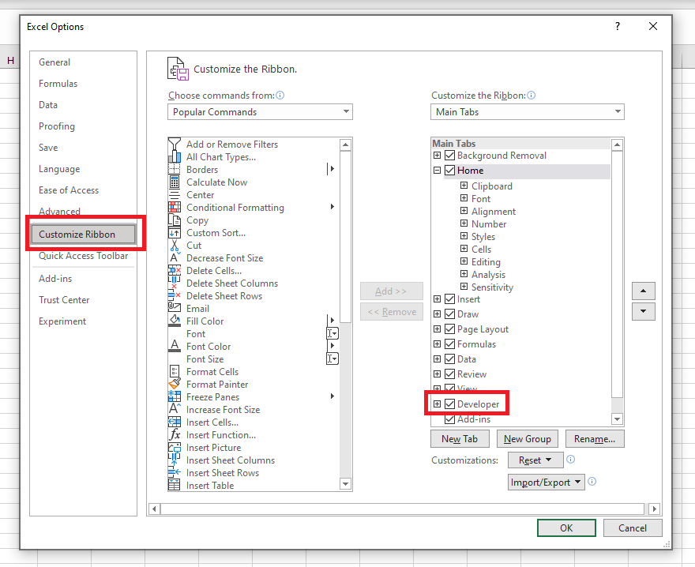
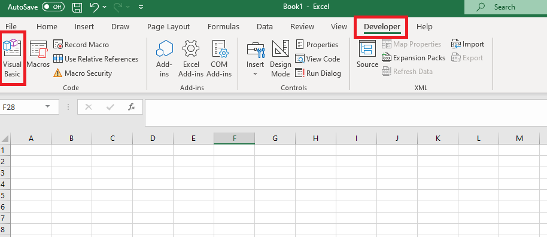
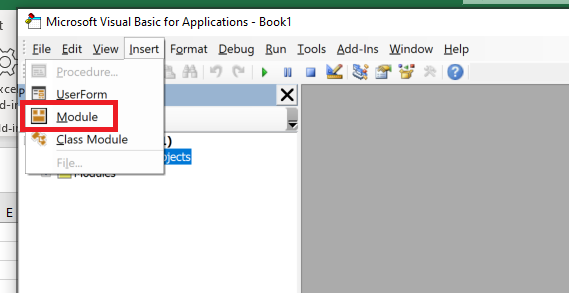
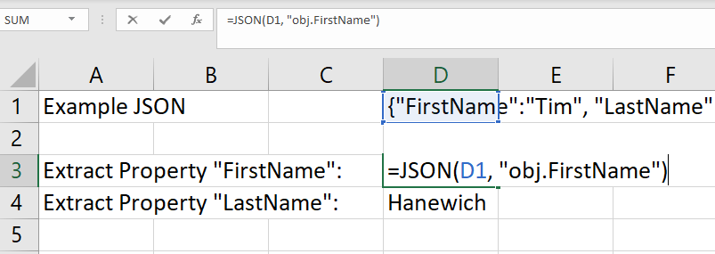

# How to Parse JSON in an Excel Spreadsheet
This builds on the terrific work of [Daniel Ferry](https://www.linkedin.com/in/excelhero/). Daniel wrote a lightweight and convenient script for parsing and manipulating JSON in VBA. I extended this a little bit to allow for the reading of JSON from the spreadsheet alone - no need for VBA from the user's perspective.

1. Enable developer mode in Excel


2. Under the developer tab in the ribbon, open **Visual Basic**


3. Insert a new module


4. Copy and paste the following code snipped into the module:
```
'-------------------------------------------------------------------
' VBA JSON Parser
'-------------------------------------------------------------------
Option Explicit
Private p&, token, dic
Function ParseJSON(JSON$, Optional key$ = "obj") As Object
    p = 1
    token = Tokenize(JSON)
    Set dic = CreateObject("Scripting.Dictionary")
    If token(p) = "{" Then ParseObj key Else ParseArr key
    Set ParseJSON = dic
End Function
Function ParseObj(key$)
    Do: p = p + 1
        Select Case token(p)
            Case "]"
            Case "[":  ParseArr key
            Case "{"
                       If token(p + 1) = "}" Then
                           p = p + 1
                           dic.Add key, "null"
                       Else
                           ParseObj key
                       End If
                
            Case "}":  key = ReducePath(key): Exit Do
            Case ":":  key = key & "." & token(p - 1)
            Case ",":  key = ReducePath(key)
            Case Else: If token(p + 1) <> ":" Then dic.Add key, token(p)
        End Select
    Loop
End Function
Function ParseArr(key$)
    Dim e&
    Do: p = p + 1
        Select Case token(p)
            Case "}"
            Case "{":  ParseObj key & ArrayID(e)
            Case "[":  ParseArr key
            Case "]":  Exit Do
            Case ":":  key = key & ArrayID(e)
            Case ",":  e = e + 1
            Case Else: dic.Add key & ArrayID(e), token(p)
        End Select
    Loop
End Function
'-------------------------------------------------------------------
' Support Functions
'-------------------------------------------------------------------
Function Tokenize(s$)
    Const Pattern = """(([^""\\]|\\.)*)""|[+\-]?(?:0|[1-9]\d*)(?:\.\d*)?(?:[eE][+\-]?\d+)?|\w+|[^\s""']+?"
    Tokenize = RExtract(s, Pattern, True)
End Function
Function RExtract(s$, Pattern, Optional bGroup1Bias As Boolean, Optional bGlobal As Boolean = True)
  Dim c&, m, n, v
  With CreateObject("vbscript.regexp")
    .Global = bGlobal
    .MultiLine = False
    .IgnoreCase = True
    .Pattern = Pattern
    If .TEST(s) Then
      Set m = .Execute(s)
      ReDim v(1 To m.Count)
      For Each n In m
        c = c + 1
        v(c) = n.Value
        If bGroup1Bias Then If Len(n.submatches(0)) Or n.Value = """""" Then v(c) = n.submatches(0)
      Next
    End If
  End With
  RExtract = v
End Function
Function ArrayID$(e)
    ArrayID = "(" & e & ")"
End Function
Function ReducePath$(key$)
    If InStr(key, ".") Then ReducePath = Left(key, InStrRev(key, ".") - 1) Else ReducePath = key
End Function
Function ListPaths(dic)
    Dim s$, v
    For Each v In dic
        s = s & v & " --> " & dic(v) & vbLf
    Next
    Debug.Print s
End Function
Function GetFilteredValues(dic, match)
    Dim c&, i&, v, w
    v = dic.keys
    ReDim w(1 To dic.Count)
    For i = 0 To UBound(v)
        If v(i) Like match Then
            c = c + 1
            w(c) = dic(v(i))
        End If
    Next
    ReDim Preserve w(1 To c)
    GetFilteredValues = w
End Function
Function GetFilteredTable(dic, cols)
    Dim c&, i&, j&, v, w, z
    v = dic.keys
    z = GetFilteredValues(dic, cols(0))
    ReDim w(1 To UBound(z), 1 To UBound(cols) + 1)
    For j = 1 To UBound(cols) + 1
         z = GetFilteredValues(dic, cols(j - 1))
         For i = 1 To UBound(z)
            w(i, j) = z(i)
         Next
    Next
    GetFilteredTable = w
End Function
Function OpenTextFile$(f)
    With CreateObject("ADODB.Stream")
        .Charset = "utf-8"
        .Open
        .LoadFromFile f
        OpenTextFile = .ReadText
    End With
End Function

'-------------------------------------------------------------------
' Functions to allow JSON parsing in spreadsheet
'-------------------------------------------------------------------
Function JSON(body$, path$)
    Set dic = ParseJSON(body)
    JSON = dic(path)
End Function
```
5. Close the code editor mini-window and the Visual Basic editor window. You should now be back in the spreadsheet.

6. Example JSON parsing and value extracting


There are additional example on how to use this function to extract embedded objects or get a specific object in an array of objects. You can find these examples in the [Example Spreadsheet](Example.xlsm).